# 📋 TaskFlow

<p align="center">
  
</p>

<p align="center">
  <b>A modern Flutter task management application designed to help you organize tasks, track your progress, and stay focused.</b>
</p>

---

## 📱 About

**TaskFlow** is a productivity-focused task management application built with Flutter.

The application allows users to create and manage tasks, organize them by category and priority, set planned start and end times, track the actual time spent working on tasks, and visualize their productivity through statistics.

TaskFlow also supports reminders and background task tracking to help users stay focused while working on their tasks.

---

## ✨ Features

### 📝 Task Management

* Create new tasks
* Edit existing tasks
* Delete tasks
* Mark tasks as completed
* Organize tasks by category
* Set task priorities
* Add task descriptions
* Set planned start and end times
* Track planned task duration
* Track actual time spent on tasks

### ⏱️ Task Timer

* Start a timer for a task
* Track the time spent on a task
* Compare planned duration with actual duration
* Continue tracking the task while the application is running in the background
* Foreground task support for active timers

### 🔔 Reminders & Notifications

* Schedule task reminders
* Local notifications
* Timezone-aware scheduled notifications
* Notification permission handling
* Exact alarm support
* Background notification support

### 📊 Productivity Statistics

Track your productivity through:

* Total completed tasks
* Pending tasks
* Completed task percentage
* Time spent on tasks
* Daily statistics
* Monthly statistics
* Yearly statistics
* Tasks grouped by category

Charts are provided to make productivity data easier to understand.

### 📅 Calendar

* Calendar-based task organization
* View tasks for a selected date
* Navigate between dates
* Display daily tasks directly from the calendar

### 👤 Profile

* Update user name
* Update profile image
* Personalize the application
* Dark mode support

### 🎨 UI & UX

* Clean and modern interface
* Light and dark themes
* Shimmer loading states
* Responsive layouts
* Material 3 components
* Custom application branding

---

## 🏗️ Architecture

TaskFlow follows a **clean and maintainable architecture** with clear separation between application layers.

The project is structured around concepts such as:

```text
Presentation
     │
     ▼
   BLoC
     │
     ▼
   Domain
     │
     ▼
    Data
     │
     ▼
  Local Database
```

### Main architectural concepts

* Clean Architecture principles
* BLoC / Cubit for state management
* Dependency Injection
* Repository-based data access
* Data Models
* Local persistence
* Separation of UI and business logic

---

## 🧰 Tech Stack

| Technology                      | Purpose                                 |
| ------------------------------- | --------------------------------------- |
| **Flutter**                     | Cross-platform application framework    |
| **Dart**                        | Programming language                    |
| **BLoC / Cubit**                | State management                        |
| **GetIt**                       | Dependency injection                    |
| **Injectable**                  | Dependency injection code generation    |
| **SQLite / Sqflite**            | Local database                          |
| **FL Chart**                    | Productivity statistics and charts      |
| **Table Calendar**              | Calendar and date-based task management |
| **Flutter Local Notifications** | Task reminders                          |
| **Timezone**                    | Timezone-aware notifications            |
| **Flutter Foreground Task**     | Background task/timer support           |
| **Permission Handler**          | Runtime permission management           |
| **Image Picker**                | Profile image selection                 |
| **Shimmer**                     | Loading placeholders                    |
| **Shared Preferences**          | Local application preferences           |

The project's current dependency configuration is defined in `pubspec.yaml`.

---

## 📂 Project Structure

The application follows a feature-oriented structure with shared core functionality.

A simplified representation:

```text
lib/
│
├── core/
│   ├── const/
│   ├── di/
│   ├── database/
│   ├── theme/
│   ├── utils/
│   └── ...
│
├── features/
│   │
│   ├── onboarding/
│   │
│   ├── home/
│   │
│   ├── tasks/
│   │
│   ├── statistics/
│   │
│   └── profile/
│
└── main.dart
```

The exact structure may evolve as the application continues to be developed.

---

## 🗃️ Local Database

TaskFlow uses **SQLite through Sqflite** for local task persistence.

Tasks contain information such as:

```text
Task
├── id
├── title
├── description
├── planned start date
├── planned duration
├── spent duration
├── completed at
├── priority
├── category
├── status
├── deleted state
└── reminder information
```

Soft deletion is used for task data where appropriate so historical productivity information can remain available for statistics.

---

## 🔔 Notification System

TaskFlow uses local notifications to provide reminders for scheduled tasks.

The notification system integrates:

* `flutter_local_notifications`
* `timezone`
* `flutter_timezone`
* Android alarm scheduling
* Runtime permission handling
* Foreground task services

This allows reminders to be scheduled using the device's local timezone and supports background task-related functionality.

---

## ⏱️ Background Timer

One of the main features of TaskFlow is the ability to track time spent working on a task.

The application uses a foreground service/task mechanism to keep the timer active when the application is moved to the background.

The timer is based on timestamps and elapsed duration rather than relying only on a UI timer, which allows the application to calculate the actual elapsed time more reliably.

---

## 🚀 Getting Started

### Prerequisites

Make sure you have Flutter installed on your machine.

Recommended environment:

```text
Flutter SDK
Dart SDK
Android Studio
Android SDK
```

---

### 1. Clone the repository

```bash
git clone https://github.com/Mo7amd-Khalid/TaskFlow.git
```

Navigate to the project:

```bash
cd TaskFlow
```

---

### 2. Install dependencies

```bash
flutter pub get
```

---

### 3. Generate dependency injection code

If the project uses generated Injectable files, run:

```bash
dart run build_runner build --delete-conflicting-outputs
```

---

### 4. Run the application

Connect an Android/iOS device or start an emulator and run:

```bash
flutter run
```

---

## 📱 Supported Platforms

The Flutter project contains platform implementations for:

* Android
* iOS


The repository currently includes the corresponding Flutter platform directories.

Some functionality, particularly notifications, exact alarms, and foreground services, is platform-specific and primarily relevant to Android.

---

## 🔐 Permissions

Depending on the platform and enabled features, TaskFlow may request permissions related to:

* Notifications
* Exact alarms
* Foreground services
* Background execution
* Image/media access

These permissions are required to support features such as task reminders and background timer functionality.

---

## 📈 Future Improvements

Potential improvements for future versions include:

* Cloud synchronization
* User authentication
* Cross-device task synchronization
* More advanced productivity analytics
* Recurring tasks
* Task categories customization
* More notification actions
* Improved background timer controls
* Productivity goals
* Weekly productivity reports

---

### 🖼️ Screenshots


### ✨ Splash Screen

<p align="center">
  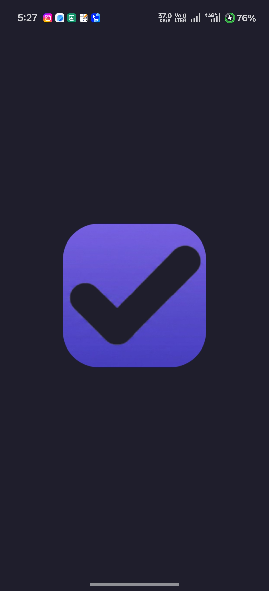
  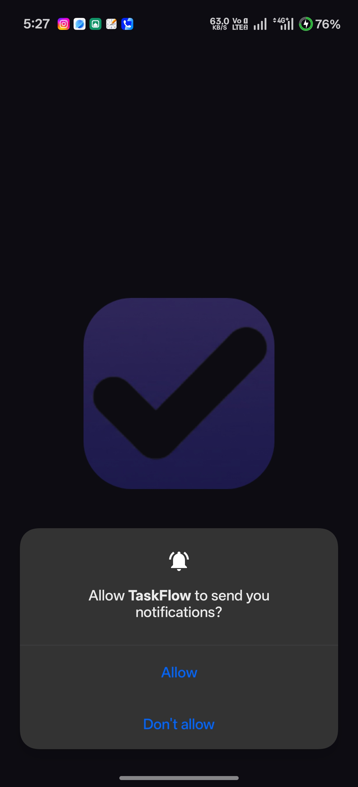
</p>

---

### 🚀 Onboarding

<p align="center">
  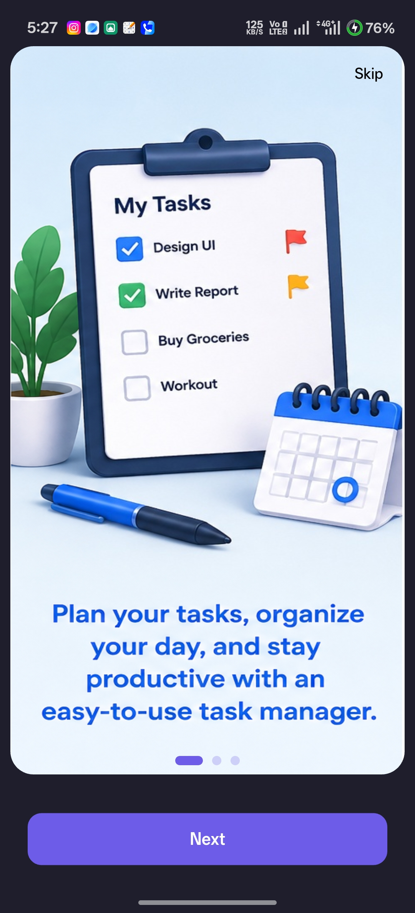
  
  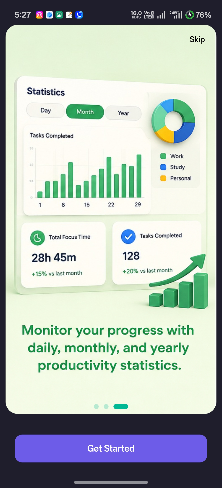
</p>

---

### 🏠 Home

<p align="center">
  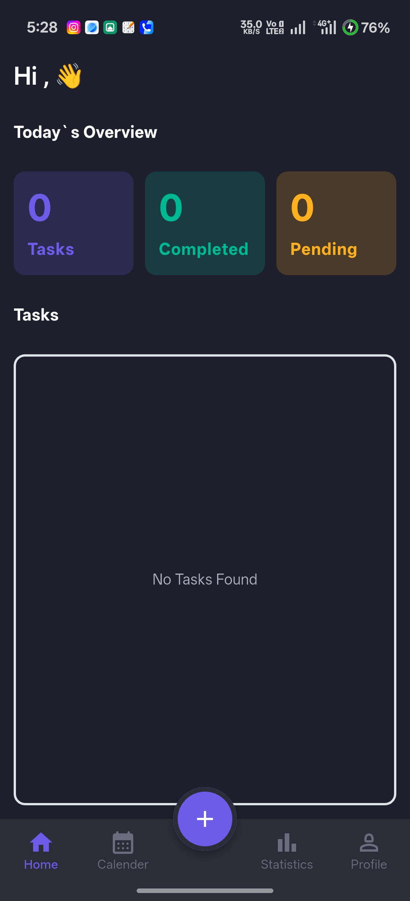
  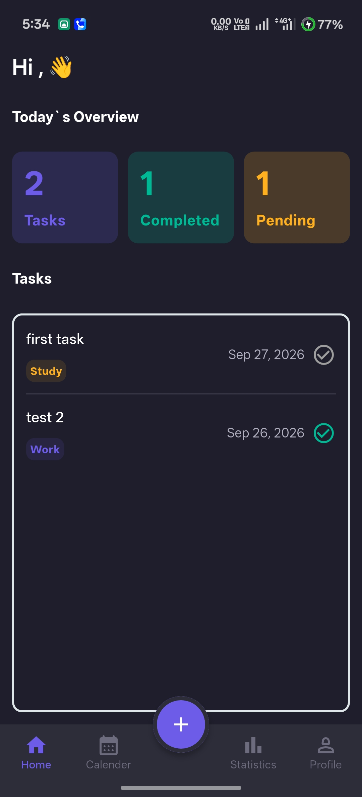
  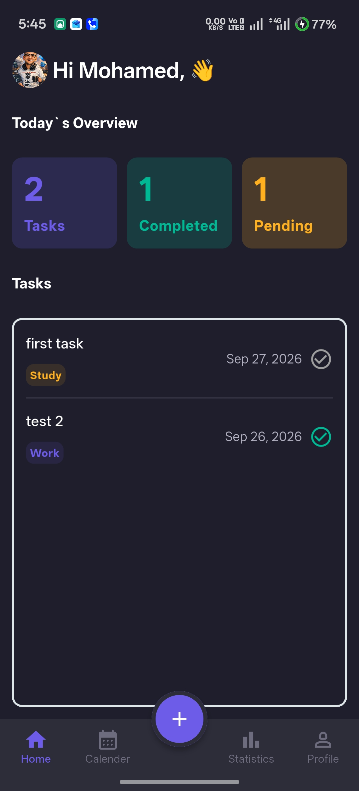
</p>

---

### ➕ Add Task

<p align="center">
  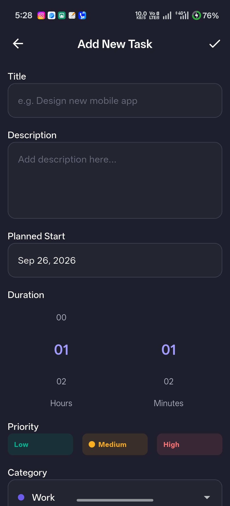
</p>

---

### 📝 Task Details

<p align="center">
  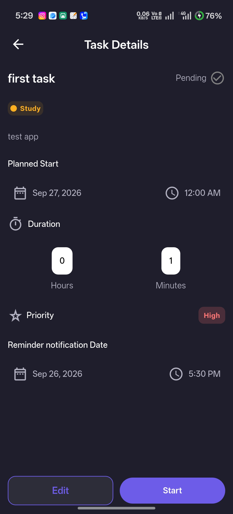
</p>

---

### 📅 Calendar

<p align="center">
  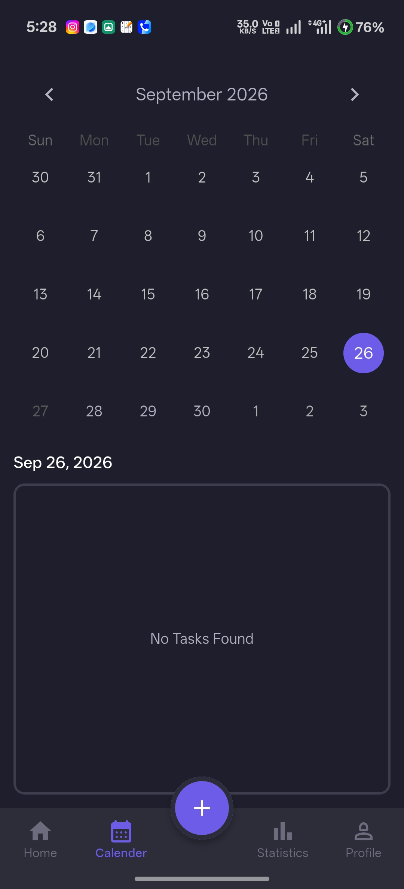
  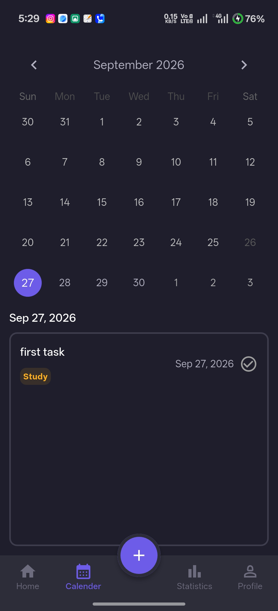
</p>

---

### ⏱️ Task Timer

<p align="center">
  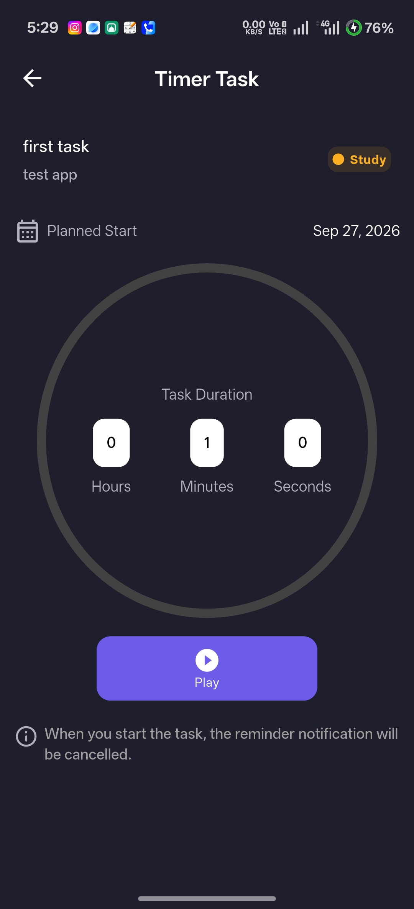
  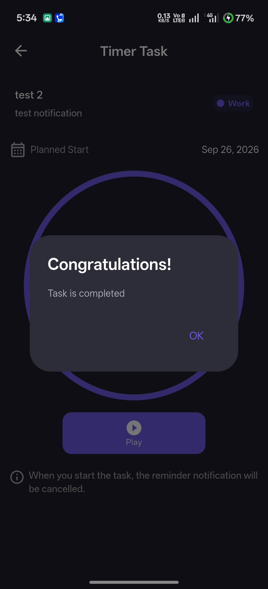
  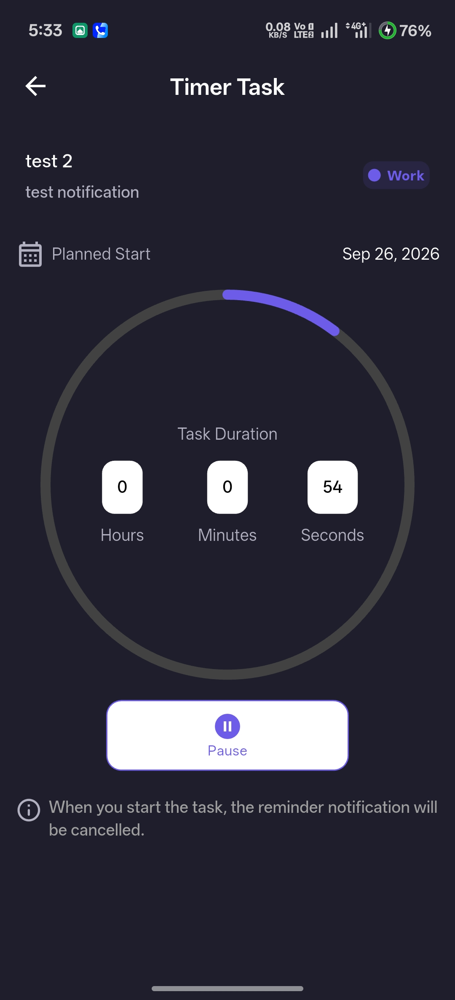
</p>

---

### 📊 Statistics

<p align="center">
  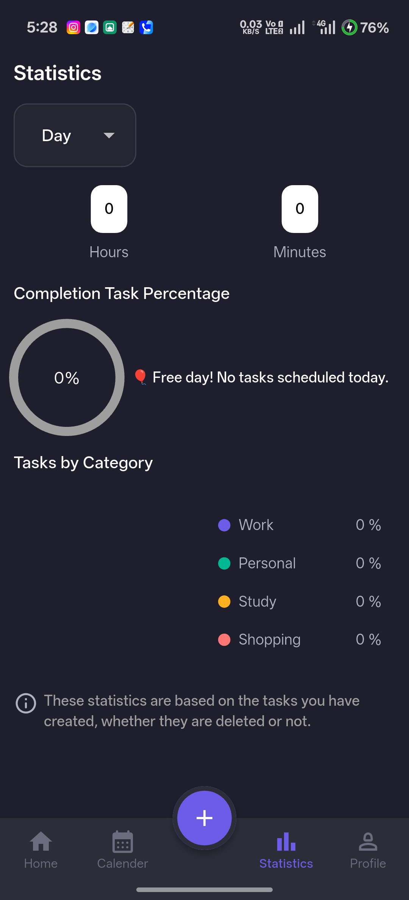
  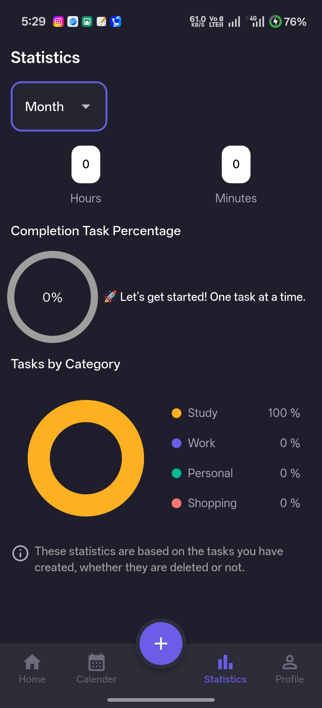
  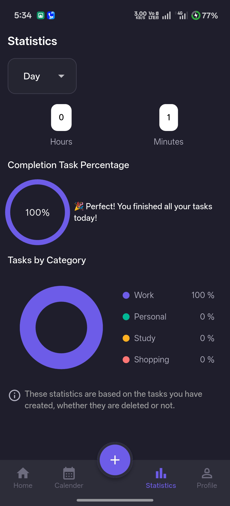
</p>

---

### 👤 Settings

<p align="center">
  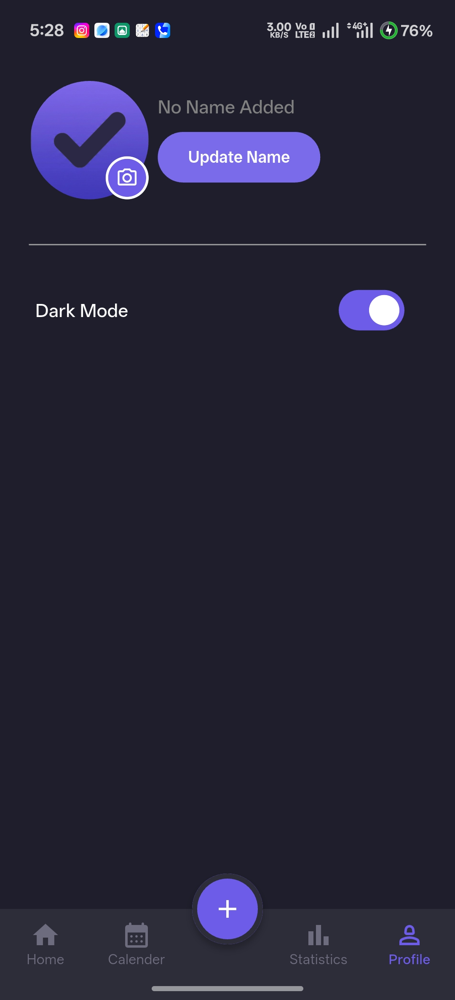
  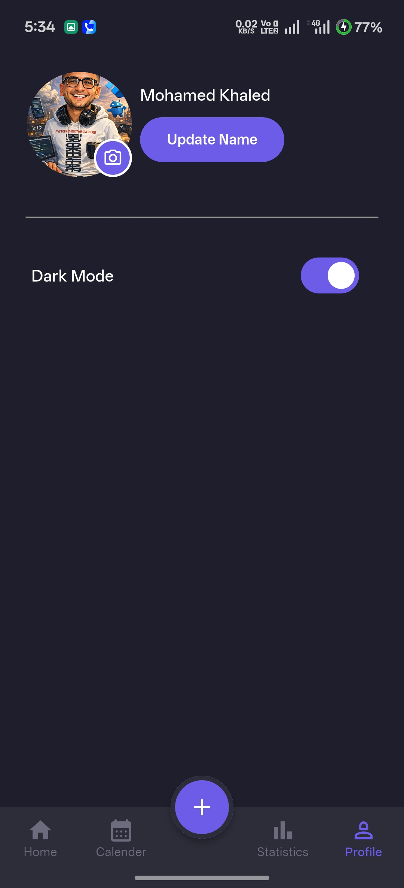
</p>

---

### 🔔 Notifications

<p align="center">
  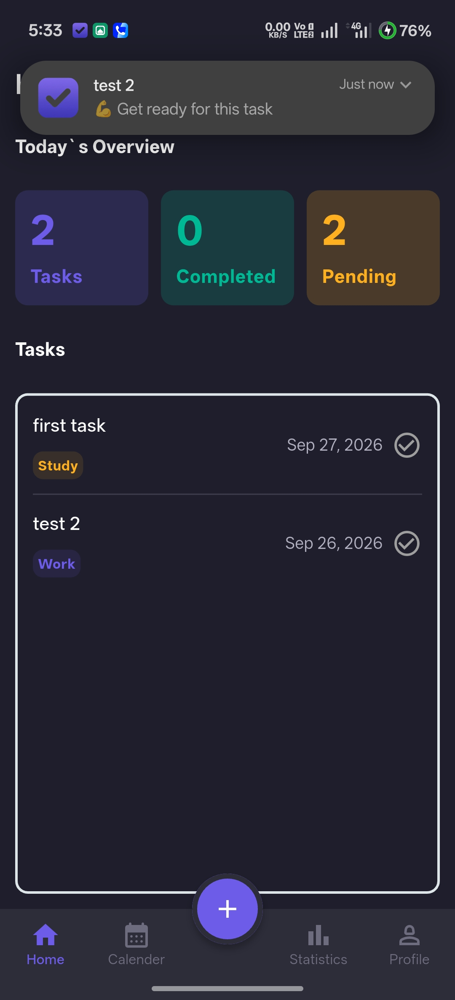
  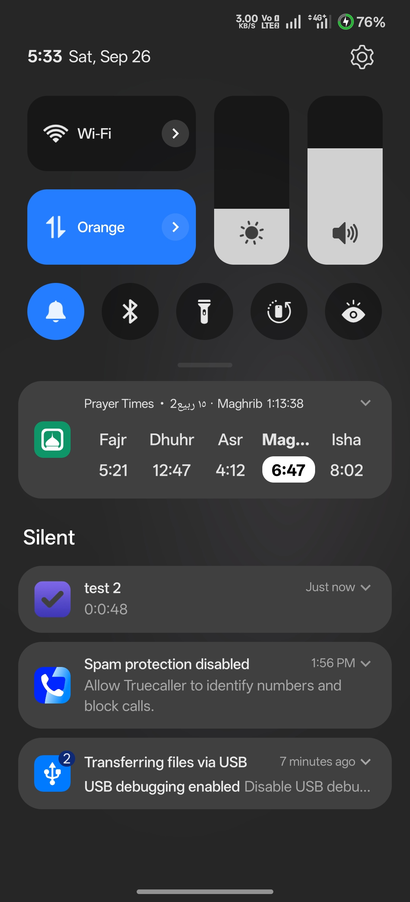
</p>

---

## 🧪 Development

Before submitting changes, run:

```bash
flutter analyze
```

and:

```bash
flutter test
```

To check outdated dependencies:

```bash
flutter pub outdated
```

---

## 📌 Project Status

**TaskFlow is currently under active development.**

Features and architecture may continue to evolve as the project grows.

---

## 👨‍💻 Author

**Mohamed Khaled**

Flutter Developer

GitHub:
https://github.com/Mo7amd-Khalid/TaskFlow

APK link:
https://drive.google.com/file/d/1YUe-zRMCq-vfeCEWvq_udIxi6M7Xz9pG/view?usp=sharing

Demo video:
https://drive.google.com/file/d/1RK3BgYc_BoQD0vcMDFBUK3IFhARYzKPf/view?usp=sharing

---

## 📄 License

This project is currently available for educational and portfolio purposes.

A formal open-source license can be added to the repository in the future.

---

<p align="center">
  Built with ❤️ using Flutter
</p>
